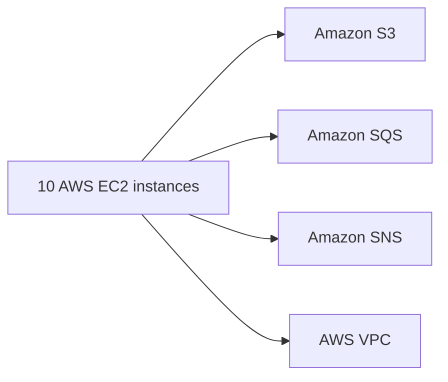

# dot.emacs
std emacs configuration across os's



```
C4Context
title System Context diagram for Internet Banking System

Person(customerA, "Banking Customer A", "A customer of the bank, with personal bank accounts.")
Person(customerB, "Banking Customer B")
Person_Ext(customerC, "Banking Customer C")
System(SystemAA, "Internet Banking System", "Allows customers to view information about their bank accounts, and make payments.")

Person(customerD, "Banking Customer D", "A customer of the bank, <br/> with personal bank accounts.")

Enterprise_Boundary(b1, "BankBoundary") {

  SystemDb_Ext(SystemE, "Mainframe Banking System", "Stores all of the core banking information about customers, accounts, transactions, etc.")

  System_Boundary(b2, "BankBoundary2") {
    System(SystemA, "Banking System A")
    System(SystemB, "Banking System B", "A system of the bank, with personal bank accounts.")
  }

  System_Ext(SystemC, "E-mail system", "The internal Microsoft Exchange e-mail system.")
  SystemDb(SystemD, "Banking System D Database", "A system of the bank, with personal bank accounts.")

  Boundary(b3, "BankBoundary3", "boundary") {
    SystemQueue(SystemF, "Banking System F Queue", "A system of the bank, with personal bank accounts.")
    SystemQueue_Ext(SystemG, "Banking System G Queue", "A system of the bank, with personal bank accounts.")
  }
}

BiRel(customerA, SystemAA, "Uses")
BiRel(SystemAA, SystemE, "Uses")
Rel(SystemAA, SystemC, "Sends e-mails", "SMTP")
Rel(SystemC, customerA, "Sends e-mails to")

```

NEW:
ruby
c-c i - doc lookup
c-c d - 'dash' app doc lookup

;;IDO mode is awesome. It's essential to know the basic shortcuts, especially the escape hatch Ctrl-f (introduction-to-ido-mode/) which gets you out of ido-mode.
IDO mode dired : 'c-c d'


TODO/BLOCKED:
Magit 0.7 is hard installed until emacs 24.4 is avail on ubuntu

Helpful:

Textmate:
 This minor mode exists to mimick TextMate's awesome
 ;; features.

;;    ⌘T - Go to File
;;  ⇧⌘T - Go to Symbol
;;    ⌘L - Go to Line
;;  ⇧⌘L - Select Line (or expand Selection to select lines)
;;    ⌘/ - Comment Line (or Selection/Region)
;;    ⌘] - Shift Right (currently indents region)
;;    ⌘[ - Shift Left  (not yet implemented)
;;  ⌥⌘] - Align Assignments
;;  ⌥⌘[ - Indent Line
;;    ⌥↑ - Column Up
;;    ⌥↓ - Column Down
;;  ⌘RET - Insert Newline at Line's End
;;  ⌥⌘T - Reset File Cache (for Go to File)

;; A "project" in textmate-mode is determined by the presence of
;; a .git directory, an .hg directory, a Rakefile, or a Makefile.

;; You can configure what makes a project root by appending a file
;; or directory name onto the `*textmate-project-roots*' list.

;; If no project root indicator is found in your current directory,
;; textmate-mode will traverse upwards until one (or none) is found.
;; The directory housing the project root indicator (e.g. a .git or .hg
;; directory) is presumed to be the project's root.

;; In other words, calling Go to File from
;; ~/Projects/fieldrunners/app/views/towers/show.html.erb will use
;; ~/Projects/fieldrunners/ as the root if ~/Projects/fieldrunners/.git
;; exists.
