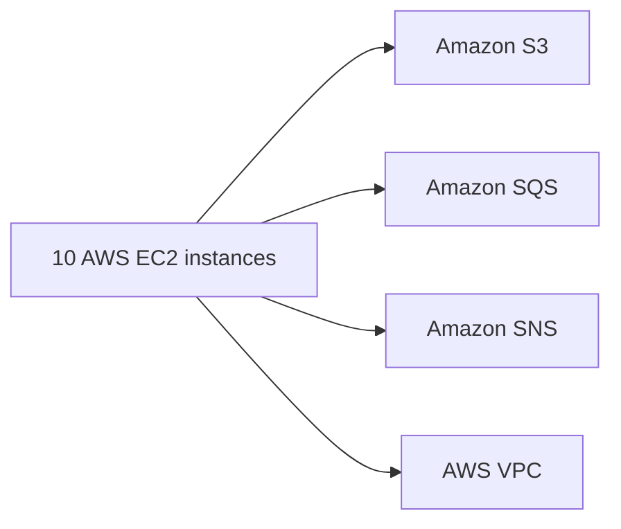

# dot.emacs
std emacs configuration across os's



<pre><code>```plantuml
@startuml
!includeurl https://raw.githubusercontent.com/RicardoNiepel/C4-PlantUML/v2.3.0/C4_Container.puml

!define AWSPUML https://raw.githubusercontent.com/awslabs/aws-icons-for-plantuml/v18.0/dist
!includeurl AWSPUML/AWSCommon.puml
!includeurl AWSPUML/SecurityIdentityCompliance/Cognito.puml
!includeurl AWSPUML/ApplicationIntegration/SimpleQueueService.puml
!includeurl AWSPUML/ApplicationIntegration/SimpleNotificationService.puml
!includeurl AWSPUML/Compute/EC2.puml
!includeurl AWSPUML/Database/DynamoDB.puml
!includeurl AWSPUML/Compute/Lambda.puml

!theme flat
!caption C4 Context diagram for AWS Engineering System

LAYOUT_WITH_LEGEND()
title AWS Engineering System - C4 Context Diagram

Person_Ext(user, "User")
System_Ext(browser, "Web Browser")
Enterprise_Boundary_AWS(aws, "AWS")

user -> browser: Uses
browser -> aws: HTTP, HTTPS

System_Int(application, "Application")
System_Db(db, "Database")
System_Msg(mq, "Message Queue")
System_Msg(tp, "Topic")

application -down-> db: Reads from and writes to
application -> mq: Sends messages to
application <- tp: Receives messages from

mq --> AWS_SQS: Uses
tp --> AWS_SNS: Uses
application --> AWS_Lambda: Uses

AWS_S3 <--> application: Stores objects
AWS_EC2 --> AWS_VPC: Runs in
@enduml
```

You can then include the resulting diagram image in your Markdown file using a similar syntax as for images:

```

```

NEW:
ruby
c-c i - doc lookup
c-c d - 'dash' app doc lookup

;;IDO mode is awesome. It's essential to know the basic shortcuts, especially the escape hatch Ctrl-f (introduction-to-ido-mode/) which gets you out of ido-mode.
IDO mode dired : 'c-c d'


TODO/BLOCKED:
Magit 0.7 is hard installed until emacs 24.4 is avail on ubuntu

Helpful:

Textmate:
 This minor mode exists to mimick TextMate's awesome
 ;; features.

;;    ⌘T - Go to File
;;  ⇧⌘T - Go to Symbol
;;    ⌘L - Go to Line
;;  ⇧⌘L - Select Line (or expand Selection to select lines)
;;    ⌘/ - Comment Line (or Selection/Region)
;;    ⌘] - Shift Right (currently indents region)
;;    ⌘[ - Shift Left  (not yet implemented)
;;  ⌥⌘] - Align Assignments
;;  ⌥⌘[ - Indent Line
;;    ⌥↑ - Column Up
;;    ⌥↓ - Column Down
;;  ⌘RET - Insert Newline at Line's End
;;  ⌥⌘T - Reset File Cache (for Go to File)

;; A "project" in textmate-mode is determined by the presence of
;; a .git directory, an .hg directory, a Rakefile, or a Makefile.

;; You can configure what makes a project root by appending a file
;; or directory name onto the `*textmate-project-roots*' list.

;; If no project root indicator is found in your current directory,
;; textmate-mode will traverse upwards until one (or none) is found.
;; The directory housing the project root indicator (e.g. a .git or .hg
;; directory) is presumed to be the project's root.

;; In other words, calling Go to File from
;; ~/Projects/fieldrunners/app/views/towers/show.html.erb will use
;; ~/Projects/fieldrunners/ as the root if ~/Projects/fieldrunners/.git
;; exists.
